author: Antonio Peñalver Caro
id: Máquina Lian_Yu
categories: Hacking Ético
environments: Web
status: Published

# Máquina: Lian_Yu

Lo primero que haremos, será realizar un escaneo de puertos con la herramienta “NMap”.

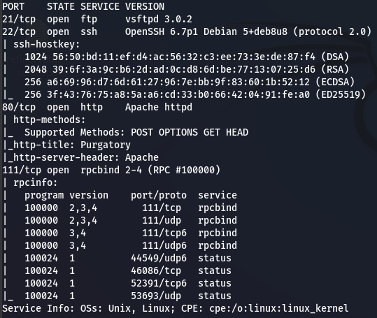

Ahora lo que se nos pide, es que indiquemos cuál es el primer directorio web de la página situada en el puerto 80 de la máquina. Para ello, usaremos “GoBuster”.

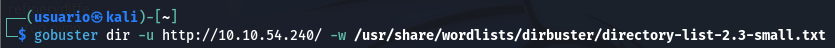

Durante la búsqueda de directorios, nos toparemos con una URL llamada:

Si colocamos dicha URL en un navegador, nos mostrará la siguiente ventana:

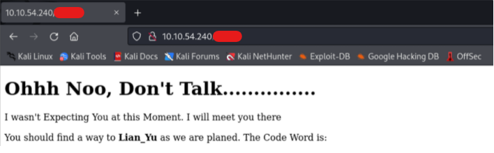

Si entramos en el código fuente de la página anterior, encontraremos cuál es la “Code Word” de la que nos habla:

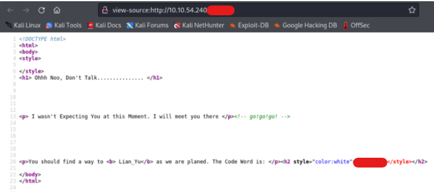

Como se observa a continuación, el “Code Word” que hemos encontrado anteriormente, resulta ser un usuario del sistema al que estamos intentando acceder, ya que al intentar conectarnos por FTP o por SSH, nos pide una contraseña. Si escribimos otro usuario cualquiera, el sistema de autenticación ambos servicios, nos devuelven un error (Esta prueba no la he mostrado en ninguna imagen, ya que es algo fácil de comprobar).

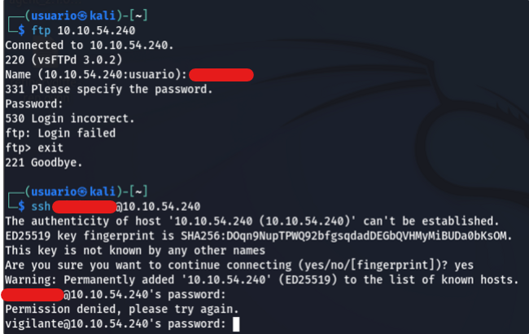

Ahora le realizaremos otro “GoBuster” a la URL que nos encontramos anteriormente.

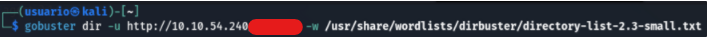

Durante la búsqueda de directorios, nos toparemos con otra URL llamada:

Si accedemos a esa URL, se nos abrirá la siguiente ventana:

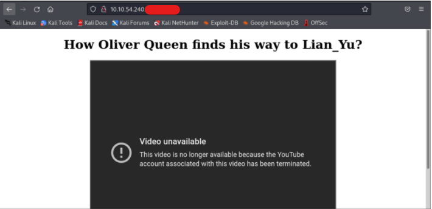

Si entramos en el código fuente de la página anterior, encontraremos lo siguiente:

Nota: El directorio que muestra esta página, es el que nos piden en el primer apartado de la actividad.

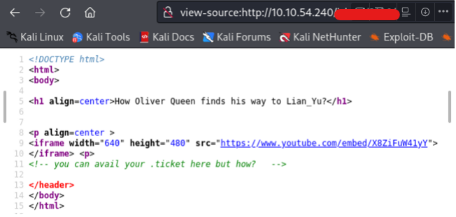

Tal y como observamos en la imagen anterior, podemos deducir leyendo la frase: “you can avail your .ticket here but how?”, que el fichero que nos piden en el segundo apartado, es un fichero “.******”.

Para poder averiguar cuál es dicho fichero, realizaremos otro “GoBuster” a la URL anterior, pero con la peculiaridad de que esta vez le indicaremos a la herramienta, que nos busque ficheros, en vez de directorios.

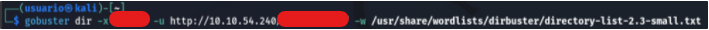

Durante la búsqueda de ficheros “.******”, nos encontraremos con el siguiente:

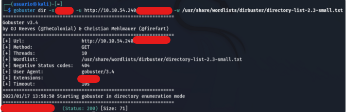

Accedemos a la URL introduciendo el fichero “*.******” que nos hemos encontrado y nos saldrá lo siguiente:

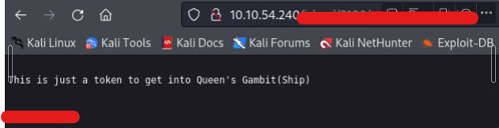

Ahora vamos a intentar decodear lo que nos ha devuelto la URL anterior utilizando CyberChef:

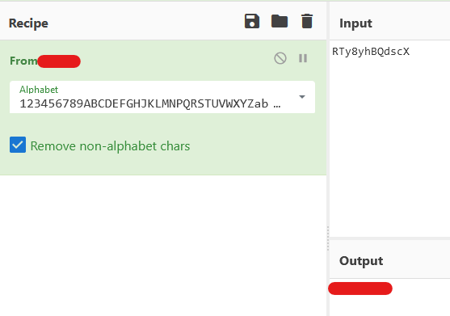

Como se observa en la imagen anterior, la imagen estaba codificada en “******”.

Con esa palabra que hemos obtenido, la cual parece ser una contraseña, vamos a intentar probarla en el FTP para ver si es la del usuario que nos encontramos al principio.

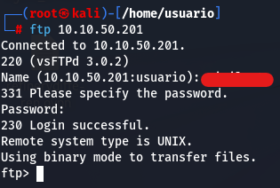

Como podemos comprobar, era la contraseña dicho usuario.

Ahora dentro del FTP, listaremos el directorio actual para ver si existe algún fichero en su interior:

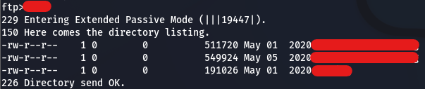

Como podemos observar en la imagen anterior, dentro del directorio del FTP, nos hemos encontrado con 3 ficheros, que en este caso son 3 imágenes.

Lo que vamos a hacer a continuación, será descargarnos dichas imágenes a nuestro equipo anfitrión utilizando el comando “***”.

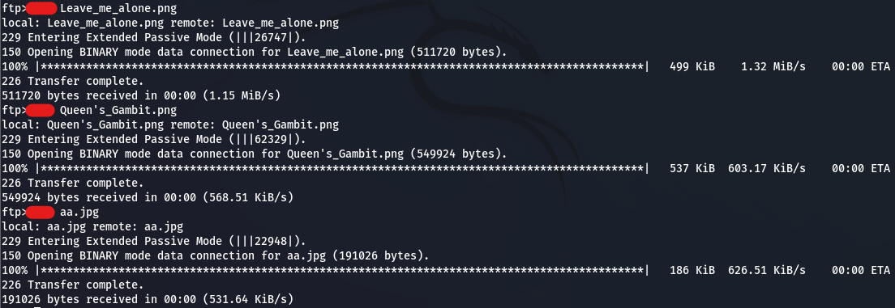

Al intentar abrir las 3 imágenes, solo 2 muestran su contenido. La imagen que resta, nos da que pensar, ya que el software que se encarga de abrir las imágenes, nos indica que esa en concreto, no se reconoce como fichero “.png” (Teniendo esta por nombre: Leave_me_alone.png).

Entonces, lo que vamos a hacer, es comprobar los llamados “Números mágicos” de la imagen que no conseguimos abrir.

Para ello, nos descargaremos el software HxD, el cual nos permitirá modificar la cabecera de la imagen que le carguemos.

Al cargar la imagen, nos daremos cuenta de que efectivamente, los números que lleva en la cabecera, no son los correctos.

Así que lo que haremos, será modificarlos de manera manual introduciendo uno por uno los números mágicos de los fichero “.png”.

Los números mágicos de las imágenes PNG son: 

89 50 4e 47 0d 0a 1a 0a

Una vez modificados dichos números, guardaremos y abriremos la imagen.

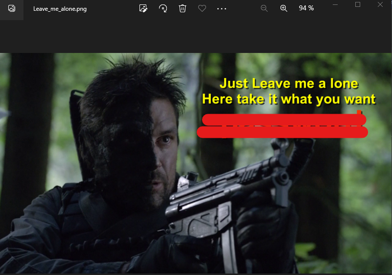

La imagen anterior, ya reparada, nos muestra lo que parece ser una contraseña, pero todavía no sabemos exactamente de qué podría ser.

Dejando la imagen anterior a un lado, por el momento, vamos a intentar averiguar si hay algo escondido detrás de las otras dos imágenes que nos descargamos anteriormente.

Para ello, utilizaremos el comando “steghide”, el cual si miramos varios ejemplos de su sintaxis, nos indica que para poder extraer información de una imagen en concreto, hay que utilizar la siguiente:

steghide extract -sf (NombreFichero)

Al escribir esto, la herramienta nos pide que anotemos un salvoconducto. Que así a bote pronto, podría ser una palabra cualquiera, pero como somos bien cucos, le vamos a introducir la palabra que nos encontramos en la imagen PNG que arreglamos anteriormente como salvoconducto.

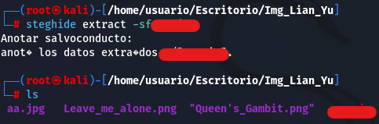

Como se observa en la imagen anterior, la palabra que apareció en la imagen PNG, era el salvoconducto para desbloquear lo oculto en este caso, en la imagen aa.jpg.

Nota: En la imagen que resta, no encontrarás nada que te permita avanzar.

El resultado del comando, es un fichero “.zip”. Si extraemos el contenido de dicho fichero, obtendremos los siguientes resultados:

Si le hacemos un “cat” al primero de ellos, podremos deducir que el resultado podría ser una posible contraseña, pero todavía no sabemos de qué.

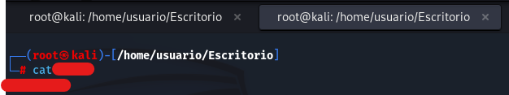

Y si le hacemos un “cat” al segundo, veremos el siguiente texto:

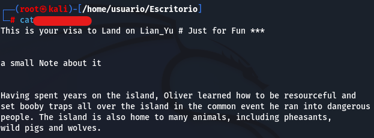

Como todavía no hemos encontrado un usuario válido para la supuesta segunda contraseña que hemos sacado, vamos a volver a ingresar en el FTP con las mismas credenciales que antes y vamos a intentar encontrarlo.

Una vez dentro del FTP, vamos a ejecutar el comando “cd ..” y luego “ls”, para poder ver si hay algo en un directorio anterior al que albergaba las imágenes que nos encontramos anteriormente.

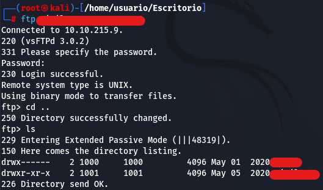

Tal y como se muestra en la imagen anterior, existe otro usuario aparte del que encontramos anteriormente. Así que, ahora es el momento de probar si dicho usuario con la segunda supuesta contraseña que encontramos, nos permite entrar por SSH a la máquina anfitriona.

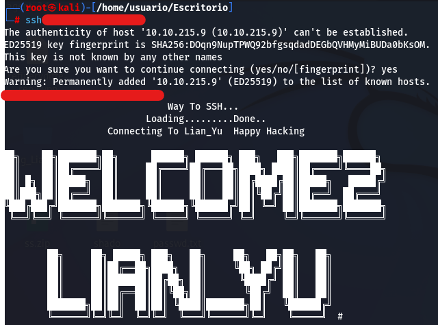

Exactamente, el segundo usuario y la segunda contraseña que encontramos anteriormente, nos han servido para poder acceder por SSH a la máquina anfitriona.

Una vez dentro, haremos un “ls”  para ver si existe algún fichero en el directorio actual.

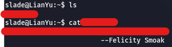

Como se observa en la imagen anterior, existe un fichero dentro del directorio en el que nos encontramos. el contenido de dicho fichero será el resultado de una de las flags más importantes del ejercicio.

Ya lo que nos quedaría, sería escalar privilegios para tratar de encontrar la última flag. Para ello, ejecutaremos el comando “sudo -l” para ver qué comandos puede ejecutar como administrador el usuario en cuestión.

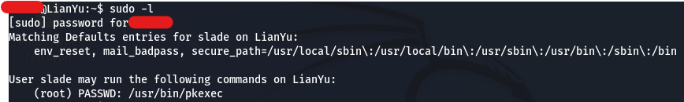

En la imagen anterior, veremos que el usuario puede usar el comando “pkexec” como administrador.

Entonces ahora, buscaremos el comando en la página “gtfobins” para ver de qué manera podemos escalar privilegios utilizándolo.

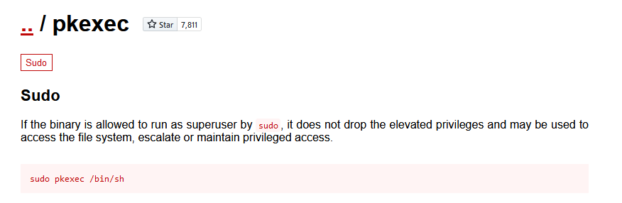

Una vez hayamos introducido lo encontrado en la página y hayamos entrado como administradores, listaremos el directorio actual y veremos si hay o no algún fichero.

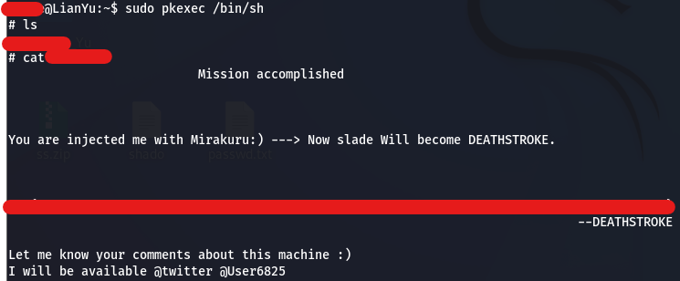

Como se observa en la imagen anterior, encontraremos el fichero que contendrá la última flag del ejercicio.
